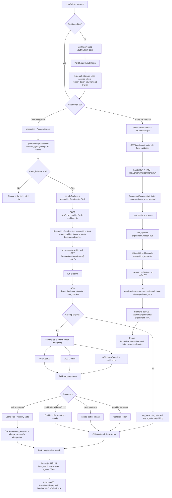

# Phân tích kỹ thuật luồng thực nghiệm và nhận diện tiền giấy

Phạm vi đọc mã nguồn: `NDTG_BCNCKH_WEB/client`, `NDTG_BCNCKH_WEB/server` và các phần liên quan trong `NDTG_BCNCKH_APP` vì app mobile dùng chung backend/API nhận diện. Tài liệu này chỉ ghi nhận các route, component, handler, API, schema, service và công thức tìm thấy trong mã nguồn. Những phần không thấy được ghi đúng là `Không tìm thấy trong mã nguồn`.

## 1. Stack kỹ thuật

| Lớp | Công nghệ/thư viện | File nguồn |
|---|---|---|
| Web client | React 19, Vite, React Router 7, Zustand, Axios, Tailwind CSS, lucide-react, react-hot-toast, i18next | `NDTG_BCNCKH_WEB/client/package.json`, `client/src/main.jsx`, `client/src/App.jsx` |
| API client | Axios instance, Bearer token, refresh token, response normalization | `client/src/services/api.js` |
| Auth state | Zustand persist key `auth-storage` | `client/src/store/authStore.js` |
| Recognition state | Zustand persist key `recognition-storage`, active task localStorage | `client/src/store/recognitionStore.js`, `client/src/services/recognitionService.js` |
| Backend API | FastAPI, router prefix `/api/v1` | `server/main.py` |
| Database | MongoDB qua Motor + Beanie | `server/app/core/database.py` |
| Auth backend | JWT access/refresh, python-jose, bcrypt/passlib | `server/app/routers/auth_router.py`, `server/app/services/auth_service.py`, `server/app/core/security.py` |
| Recognition backend | FastAPI upload, async task, OpenCV/YOLO crop, OpenAI/Gemini/Lens agents, AG4 aggregator | `server/app/routers/recognition_router.py`, `server/app/services/recognition_service.py`, `server/app/agents/*` |
| Experiment backend | Admin-only batch experiment, export Excel, metrics calculator | `server/app/routers/experiment_router.py`, `server/app/services/experiment_service.py`, `server/app/services/metrics_service.py` |
| Mobile app liên quan | Flutter, Dio, Provider/SecureStorage, cùng endpoints nhận diện | `NDTG_BCNCKH_APP/lib/core/constants/api_endpoints.dart`, `lib/features/recognition/*` |

## 2. Route và màn hình chính

### 2.1 Web route

| Mục đích | Route | Guard | Component/file |
|---|---|---|---|
| Đăng nhập user | `/auth/login` | public | `client/src/pages/auth/Login.jsx` |
| Đăng nhập admin | `/auth/admin-login` | public | `client/src/pages/auth/AdminLogin.jsx` |
| OAuth Google success | `/auth/google/success` | public | `client/src/pages/auth/GoogleSuccess.jsx` |
| Upload/nhận diện | `/recognize`, `/workspace` | `UserRoute` | `client/src/pages/user/Recognition.jsx` |
| Đang xử lý task | `/processing`, `/processing/:taskId` | `UserRoute` | `client/src/pages/user/Processing.jsx` |
| Kết quả | `/result` | `UserRoute` | `client/src/pages/user/Result.jsx` |
| Chi tiết agent/result | `/result/detail`, `/agent-result-detail` | `UserRoute` | `client/src/pages/user/AgentResultDetail.jsx` |
| Lịch sử user | `/history` | `UserRoute` | `client/src/pages/user/History.jsx` |
| Gửi phản hồi | `/feedback` | `UserRoute` | `client/src/pages/user/Feedback.jsx` |
| Admin thực nghiệm | `/admin/experiments` | `AdminRoute`, thêm điều kiện `VITE_ENABLE_EXPERIMENT_PAGE` | `client/src/pages/admin/Experiments.jsx`, `client/src/routes/AppRoutes.jsx` |
| Admin benchmark metrics | `/admin/benchmark-metrics` | `AdminRoute` | `client/src/pages/admin/BenchmarkMetrics.jsx` |
| Admin kết quả nhận diện | `/admin/results` | `AdminRoute` | `client/src/pages/admin/ResultsManager.jsx` |
| Admin dashboard/log/settings | `/admin/dashboard`, `/admin/logs`, `/admin/settings` | `AdminRoute` | `client/src/routes/AppRoutes.jsx` |

`UserRoute` chuyển user chưa đăng nhập sang `/auth/login`. `AdminRoute` chuyển user chưa đăng nhập sang `/auth/admin-login`, còn user không có `role === "admin"` sang `/404`. Các guard này nằm trong `client/src/routes/PrivateRoutes.jsx`.

### 2.2 Backend API route

| API | Method | Auth | Controller/service |
|---|---:|---|---|
| `/api/v1/auth/login` | POST | public | `AuthService.login_user` |
| `/api/v1/auth/refresh` | POST | public | `AuthService.refresh_access_token` |
| `/api/v1/users/me` | GET | user | user router/service |
| `/api/v1/users/me/history` | GET | user | user router/service |
| `/api/v1/recognition/scan` | POST | user | `RecognitionController.recognize` |
| `/api/v1/recognition/debug_scan` | POST | admin | `RecognitionController.debug_recognize` |
| `/api/v1/recognition/tasks` | POST | user | `RecognitionController.start_task` |
| `/api/v1/recognition/tasks/{task_id}` | GET | owner/admin | `RecognitionController.get_task_status` |
| `/api/v1/recognition/{record_id}` | GET | owner/admin | `RecognitionController.get_result_detail` |
| `/api/v1/admin/experiments/run` | POST | admin | `ExperimentController.run` |
| `/api/v1/admin/experiments` | GET | admin | `ExperimentController.list` |
| `/api/v1/admin/experiments/{experiment_id}/stop` | POST | admin | `ExperimentController.stop` |
| `/api/v1/admin/experiments/export` | GET | admin | `ExperimentController.export` |
| `/api/v1/admin/experiments/metrics-calculator` | POST | admin | `ExperimentController.metrics_calculator` |
| `/api/v1/admin/benchmark-metrics/export` | POST | admin | benchmark metrics router/service |
| `/api/v1/admin/results` | GET | admin | `AdminService.get_all_results` |
| `/api/v1/admin/results/{id}` | GET | admin | controller tồn tại nhưng service detail chưa có |
| `/api/v1/admin/results/{id}` | DELETE | admin | `AdminService.delete_result` |
| `/api/v1/admin/results/{id}/review` | PUT | admin | `AdminService.review_result` |
| `/api/v1/admin/results/{id}/rerun` | POST | admin | `AdminService.rerun_result` |

## 3. Xác thực và phân quyền

### 3.1 Đăng nhập user

| Bước | Màn hình/handler | API/request | Response/state | Chuyển trạng thái/lỗi |
|---|---|---|---|---|
| Nhập email/password | `Login.jsx`, submit gọi `authService.login(email, password)` | `POST /api/v1/auth/login`, body `{ email, password }` | Backend trả `access_token`, `refresh_token`, `user`; frontend gọi `authStore.login(user, access_token, refresh_token)` | Thành công navigate `/`. Thất bại hiển thị toast/message từ API |
| Gắn token vào request | `client/src/services/api.js` request interceptor | Header `Authorization: Bearer <token>` | Lấy token từ Zustand `auth-storage` hoặc localStorage fallback | Nếu không có token thì request không gắn Authorization |
| Refresh token | `api.js` response interceptor khi HTTP 401 | `POST /api/v1/auth/refresh`, body `{ refresh_token }` | Cập nhật `authStore.token` và `authStore.refreshToken`, retry request gốc | Nếu refresh lỗi/no refresh token: logout và reject |

Backend login nằm ở `server/app/services/auth_service.py`. `login_user` kiểm tra email, password, `is_active`, cập nhật `last_login_at`, rồi tạo access và refresh JWT bằng `server/app/core/security.py`. `get_current_user` trong `server/app/core/dependencies.py` decode Bearer token, lấy `User` theo id và từ chối user inactive.

### 3.2 Đăng nhập admin

| Bước | Màn hình/handler | API/request | Response/state | Chuyển trạng thái/lỗi |
|---|---|---|---|---|
| Nhập email/password admin | `AdminLogin.jsx` | `POST /api/v1/auth/login` | Nếu `data.user.role === "admin"` thì `loginStore(data.user, data.access_token)` | Thành công navigate `/admin/dashboard`; không phải admin thì báo lỗi |
| Guard admin route | `AdminRoute` trong `PrivateRoutes.jsx` | Không gọi API | Dựa trên `authStore.user.role` | Chưa login: `/auth/admin-login`; không phải admin: `/404` |
| Backend admin | `require_admin` | Bearer JWT | User phải có `role === "admin"` | Không đủ quyền trả HTTP 403 |

Lưu ý kỹ thuật: `AdminLogin.jsx` không truyền `refresh_token` vào `authStore.login`, trong khi `Login.jsx` có truyền. Vì vậy session admin có thể không refresh được access token khi hết hạn. Đây là hành vi thấy trong mã nguồn.

### 3.3 Google OAuth

Backend callback `auth_router.py` redirect web về `/auth/google/success?token=...&refresh_token=...`. `GoogleSuccess.jsx` chỉ đọc query `token`, gọi `/users/me`, rồi `loginStore(userProfile, token)`. `refresh_token` từ URL không được lưu trong frontend. Đây là hành vi thấy trong mã nguồn.

## 4. Luồng user nhận diện tiền giấy

### 4.1 Tổng quan tuyến dữ liệu

User upload ảnh ở `/recognize`, frontend tạo recognition task bằng `POST /recognition/tasks`, trang `/processing/:taskId` poll trạng thái bằng `GET /recognition/tasks/{taskId}`, backend chạy pipeline AG0-AG4 bất đồng bộ, lưu `recognition_tasks` và nếu kết quả chargeable thì lưu `recognition_requests` + trừ token, sau đó frontend chuyển sang `/result`.

### 4.2 Chọn ảnh và validate trên web

| Trường | Chi tiết |
|---|---|
| Màn hình | `/recognize` hoặc `/workspace` |
| Component | `client/src/pages/user/Recognition.jsx` |
| Upload component | `client/src/components/workspace/UploadZone.jsx` |
| Handler chính | `processFile(file)`, `handleAnalyze()` |
| State | `recognitionStore.setCurrentImage(file, previewUrl)`, `currentImageFile`, `currentPreviewUrl`, `currentFileFingerprint`, `isScanning` |
| Storage | Zustand persist key `recognition-storage`; active task localStorage key do `recognitionService.saveActiveRecognitionTask` quản lý |

Validate trong `UploadZone.jsx`:

| Điều kiện | Xử lý |
|---|---|
| MIME không thuộc `image/jpeg`, `image/png`, `image/webp` | Toast lỗi, không set ảnh |
| File rỗng hoặc không đọc được | Toast lỗi |
| `file.size > 5 * 1024 * 1024` | Toast lỗi |
| Ảnh có width/height `< 200` | Chỉ cảnh báo nhỏ/low-quality, không chặn xử lý |
| User không đủ token (`token_balance <= 0`) | Disable nút phân tích, hiển thị cảnh báo |
| Đủ điều kiện | `canAnalyze = !isScanning && hasValidFile && hasEnoughTokens` |

Ảnh camera được tạo thành JPEG `camera_capture.jpg` rồi đi qua cùng `processFile`.

### 4.3 Tạo task nhận diện

| Bước | File/handler | API/request | Response/state | Transition |
|---|---|---|---|---|
| Bấm phân tích | `UploadZone.jsx`, `handleAnalyze()` | Gọi `recognitionService.startTask(file)` | Response có `task_id` hoặc `id` | Lưu active task, navigate `/processing/${taskId}` |
| API client | `client/src/services/recognitionService.js`, `startTask(file)` | `POST /api/v1/recognition/tasks`, `FormData { file }`, multipart | Axios trả normalized data | Nếu lỗi API: reset scanning/toast |
| Backend controller | `RecognitionController.start_task` | `UploadFile file`, user từ `get_current_user` | Gọi `RecognitionService.start_recognition_task(current_user, image_bytes)` | Nếu `content_type` không bắt đầu `image/`: HTTP 400 |
| Backend service | `RecognitionService.start_recognition_task` | `user`, `image_bytes` | Tạo `RecognitionTask(status="queued", stage="queued", progress=5)`, lưu input ảnh, chạy background worker | Nếu `token_balance < 1`: HTTP 402 |

Backend lưu ảnh input task vào thư mục `server/uploads/recognition_tasks` qua `save_task_input_image`. Trường DB liên quan nằm trong model `server/app/models/recognition_task_model.py`: `input_image_url`, `input_image_path`, `status`, `stage`, `progress`, `result`, `result_id`, `error_message`.

### 4.4 Poll trạng thái xử lý

| Trường | Chi tiết |
|---|---|
| Màn hình | `/processing`, `/processing/:taskId` |
| Component | `client/src/pages/user/Processing.jsx` |
| Poll interval | `POLL_INTERVAL_MS = 2000` |
| Max poll time | `MAX_POLL_TIME_MS = 4 * 60 * 1000` |
| API | `GET /api/v1/recognition/tasks/{task_id}` |
| State update | `setTaskSnapshot`, `setStage`, `setProgress`, `recognitionStore.updateActiveTaskFromBackend` |
| Thành công | `finishSuccessfully(task)` dựng result, gọi `setScanSession`, sync profile/token, navigate `/result` |
| 404 | Clear active task, navigate `/recognize` |
| Network/5xx | Retry |
| Lỗi khác | Đưa UI về trạng thái failed |

Terminal done statuses trong frontend gồm `done`, `completed`, `completed_with_limit`, `completed_partial`, `complete`, `success`, `succeeded`, `needs_review`, `needs review`, `no_banknote_detected`, `needs_better_image`. Terminal failed statuses gồm `failed`, `failure`, `error`, `cancelled`, `canceled`, `timeout`, `agent_error`, `technical_error`.

`Recognition.jsx` cũng poll active task đã lưu mỗi 3 giây để hiển thị banner task đang chạy hoặc task vừa hoàn tất. TTL active task trong store là 10 phút.

### 4.5 Pipeline backend AG0-AG4

Handler backend chính là `RecognitionService.run_pipeline` trong `server/app/services/recognition_service.py`.

| Giai đoạn | File/hàm | Input | Output/state | Lỗi/chuyển nhánh |
|---|---|---|---|---|
| Kiểm tra size/token | `run_pipeline` | `image_bytes`, `user`, `experiment_mode` | Tiếp tục xử lý | Ảnh > 5MB bị reject. User mode kiểm tra token trước khi chạy; experiment mode bỏ qua billing |
| Lưu/upload ảnh | `save_task_input_image`, `upload_input_image_with_timeout` | bytes ảnh | `input_image_path/url`, Cloudinary URL nếu có | Cloudinary lỗi thì tiếp tục với URL rỗng |
| AG0 detect/crop | `detect_banknote_objects` trong `server/app/utils/image_processing.py` | bytes ảnh | Danh sách crop/candidate + `crop_checker` | Nếu không có object đủ điều kiện: trả/lưu status `no_banknote_detected`, không gọi agents, không trừ token |
| AG0 crop checker | `classify_crop`, `compute_crop_metrics` trong `server/app/utils/crop_checker.py` | crop image + bbox | `agent_eligible`, score, decision KEEP/REVIEW/DROP | Candidate không eligible đưa vào `rejected_objects` |
| Giới hạn object | `MAX_PROCESSED_BANKNOTE_OBJECTS = 3` | eligible candidates | Chọn top 3 theo score/confidence/area | Object dư đưa vào `limit_info`, status có thể thành `completed_with_limit` |
| Resize ảnh agent | `_resolve_resize_policy`, `_resize_image_bytes_for_api` | crop bytes | bytes tối ưu theo agent | Mặc định user/experiment không bật resize nếu config giữ mặc định |
| AG1 OpenAI | `run_agent1_openai` | crop/data URL + prompt | JSON vote hoặc Failed | Thiếu API key/auth/provider lỗi được trả thành trạng thái lỗi agent |
| AG2 Gemini | `run_agent2_llm` | crop + prompt | JSON vote hoặc Failed | Có model chain, validate lại output bắt buộc có quốc gia/tiền tệ/mệnh giá |
| AG3 Lens/search | `run_agent3_lens` | crop/image context | JSON vote hoặc Failed | Provider mặc định SerpAPI; Selenium fallback mặc định tắt |
| AG3 verify | `run_agent3_candidate_verification` | AG3 candidate | verification metadata | Timeout thì dùng fallback |
| AG4 aggregator | `run_aggregator` | votes AG1/AG2/AG3 | consensus/final_result | Conflict, zero evidence, transient error được phân loại riêng |
| Retry | logic trong `run_pipeline` | consensus pattern | Có thể chạy lại theo pattern/config | AG4 conflict rerun mặc định bị tắt trong config |
| Persistence/billing | `RecognitionRequest`, `TokenBillingService.charge_user_for_scan` | final result | Ghi DB, trừ token nếu chargeable | Non-chargeable/debug/experiment không trừ token |

### 4.6 Công thức AG0 crop checker

Trong `server/app/utils/crop_checker.py`:

```text
banknote_score =
  0.22 * aspect_score
+ 0.14 * texture_score
+ 0.12 * edge_score
+ 0.10 * contrast_score
+ 0.10 * color_richness
+ 0.04 * saturation_score
+ 0.10 * area_score
+ 0.10 * yolo_confidence
+ 0.08 * outer_border_score
```

```text
document_score =
  0.18 * white_signal
+ 0.06 * low_color_signal
+ 0.03 * low_saturation_signal
+ 0.18 * long_line_signal
+ 0.10 * rectangle_signal
+ 0.07 * directional_signal
+ 0.08 * extreme_aspect_signal
+ 0.30 * layout_clutter_score
```

Cả hai score được clamp trong khoảng 0..1. `agent_eligible` phụ thuộc vào decision KEEP/REVIEW/DROP, tương quan banknote/document score và cấu hình crop checker.

### 4.7 Công thức consensus AG4

File: `server/app/agents/agent_aggregator.py`.

| Điều kiện | Consensus pattern/status |
|---|---|
| Mỗi agent được normalize thành vote key `(country.lower(), currency.upper(), amount)` | Vote hợp lệ |
| Agent có trạng thái thuộc `NON_VOTING_STATUSES` hoặc `not_counted_in_consensus` | Không tính vào consensus |
| Có ít nhất 2 vote trùng key | `Completed`, `majority_vote`, pattern `2/3` hoặc `3/3` |
| Không có valid vote nhưng có transient/provider error | `technical_error`, pattern `transient_error` |
| Không có evidence hợp lệ | `needs_better_image`, pattern `not_banknote_or_unclear` |
| Chỉ 1 valid vote | `Conflict`, pattern `1-valid-only`, có `suggested_result_from_valid_agent` |
| Từ 2 valid vote trở lên nhưng mỗi vote một key | `Conflict`, pattern `1-1-1` |
| Khác | `Conflict`, pattern `conflict` |

Kết quả majority lấy mệnh giá/currency/country từ winning vote, kèm `matched_agents`, `valid_votes`, `consensus_pattern`. Ưu tiên `final_agent` theo thứ tự trong code: `llm_api`, `openai_api`, `ml_dl`.

### 4.8 Billing và persistence của user recognition

| Điều kiện | DB/storage | Chi tiết |
|---|---|---|
| Task tạo thành công | Collection `recognition_tasks` | Model `RecognitionTask`, lưu task/progress/stage/result/result_id |
| Pipeline có kết quả non-experiment | Collection `recognition_requests` | Model `RecognitionRequest`, lưu `final_result`, `agent_results`, `uploaded_image_url`, `task_id`, token fields |
| Chargeable | Collection `token_usages`, collection `users` | `TokenBillingService.charge_user_for_scan` trừ token atomic và ghi usage |
| Chargeable statuses | Trong `run_pipeline` | `completed`, `completed_partial`, `completed_with_limit` và phải có valid votes |
| Không trừ token | Debug/experiment, no banknote, needs better image, technical/agent error, zero evidence | `billing_skipped` hoặc `system_tokens_charged=0` |

`TokenBillingService.calculate_billable_ai_tokens`:

```text
billable_ai_tokens = ceil((input_tokens + output_tokens) * (1 + tax_rate))
```

`TokenBillingService.calculate_system_tokens`:

```text
system_tokens = billable_ai_tokens / ai_tokens_per_app_token
```

Sau đó áp dụng rounding mode, min/max token theo cấu hình. Nếu billing mode là fixed thì dùng `token_cost_per_scan`.

### 4.9 Hiển thị kết quả, lịch sử, export và report của user

| Tính năng | Màn hình/file | API/state | Ghi chú |
|---|---|---|---|
| Result | `client/src/pages/user/Result.jsx` | Nhận `location.state.scanResult` hoặc fetch `GET /recognition/tasks/{taskId}` / `GET /recognition/{resultId}` | Chuẩn hóa backend result, hiển thị final decision, ảnh, consensus, agent votes, token usage, raw JSON |
| Copy JSON | `Result.jsx`, `handleCopyJSON` | Browser clipboard | Copy JSON của item hiện tại |
| Download JSON | `Result.jsx`, `handleDownloadJSON` | Browser download | Tên file `banknote_result_{index}.json` |
| Agent detail | `AgentResultDetail.jsx` | `location.state` hoặc `getRecognitionResult(id)` | Nếu query là `taskId` thì component vẫn gọi `/recognition/{id}`; route này cần `record_id`, không phải `task_id` |
| Report wrong recognition | `AgentResultDetail.jsx`, `handleReportWrongRecognition` | Navigate `/feedback` với `feedbackDraft` | Draft type `wrong_result`, priority high, `related_result_id` |
| History | `History.jsx` | `GET /users/me/history` qua `userService.getMyHistory` | Sort mới nhất, filter client-side |
| History export CSV | `History.jsx`, `handleExportCSV` | Browser CSV download | Cột token cost đang hard-code `"1"` thay vì dùng `system_tokens_charged` |
| Feedback submit | `Feedback.jsx`, `feedbackService.submitFeedback` | `POST /feedback/` | Backend ghi collection `feedbacks` |

## 5. Luồng admin thực nghiệm

### 5.1 Điều kiện bật tính năng

| Lớp | Điều kiện | File |
|---|---|---|
| Frontend route | `/admin/experiments` chỉ được add khi `import.meta.env.VITE_ENABLE_EXPERIMENT_PAGE` truthy | `client/src/routes/AppRoutes.jsx` |
| Backend API | `ExperimentController.ensure_enabled` yêu cầu `settings.ENABLE_EXPERIMENT_API` | `server/app/controllers/experiment_controller.py`, `server/app/core/config.py` |
| Auth | Web guard `AdminRoute`, backend dependency `require_admin` | `PrivateRoutes.jsx`, `server/app/core/dependencies.py` |

### 5.2 Tạo/chạy experiment từ admin web

| Bước | File/handler | Request/state | Response/storage | Transition/lỗi |
|---|---|---|---|---|
| Mở trang | `/admin/experiments`, `Experiments.jsx` | Load filters/history bằng `getAdminExperiments` | Hiển thị danh sách run | Không phải admin bị guard chặn |
| Upload benchmark CSV | `parseBenchmarkCsv`, `parseCsvRows` | CSV phải có `file_name`, `dataset_id`, `image_id`, `ground_truth_country`, `ground_truth_currency`, `ground_truth_denomination` | Có thể autofill form theo tên ảnh | Thiếu required/recommended hoặc duplicate được đưa vào warning/issues |
| Chọn ảnh | `handleFile` | File MIME phải `startsWith("image/")`, tạo preview URL | `selectedFile`, metadata benchmark nếu match | Frontend không thấy check 5MB ở experiment page; backend có check |
| Nhập ground truth | `INITIAL_FORM`, `validationIssues` | Required: dataset_id, image_id, country, currency, denomination | denomination normalize `.trim().replace(/[,\s]+/g, "")`; phải là số >0 | Thiếu/invalid thì không cho chạy |
| Chạy | `handleRun` | `FormData` gồm file, dataset/image, GT, `repeat_count`, `delay_between_runs`, stop flags, `force_rerun` | `runAdminExperiment` gọi `POST /admin/experiments/run`; trả `experiment_id`, runs | Set `activeExperimentId`, poll current experiment |
| Poll | `pollCurrentExperiment` mỗi 2s | `GET /admin/experiments?experiment_id=...` | Cập nhật `currentRuns`/history | Nếu không còn status queued/running thì dừng active |
| Stop remaining | `handleStopRemaining` | `POST /admin/experiments/{experiment_id}/stop` | Các run queued/running chuyển stopped | Refresh history |
| Export | `handleExport` | `GET /admin/experiments/export` với filters | Download `.xlsx` | Timeout axios 180s |
| Metrics calculator | `handleCalculateMetrics` | Upload `.xlsx/.xls` tới `/admin/experiments/metrics-calculator` | Download workbook metrics | File sai columns trả lỗi |

Request backend `/admin/experiments/run` trong `server/app/routers/experiment_router.py`:

```text
multipart/form-data:
  file
  dataset_id
  image_id
  ground_truth_country
  ground_truth_currency
  ground_truth_denomination
  repeat_count                 1..3
  delay_between_runs           0..60
  stop_on_rate_limit           bool
  stop_on_provider_error       bool
  force_rerun                  bool
```

Response do service trả về có `experiment_id`, danh sách `runs` và metadata batch. Mỗi run được ghi vào collection `experiment_runs`.

### 5.3 Backend experiment service

| Giai đoạn | File/hàm | Chi tiết |
|---|---|---|
| Validate request | `ExperimentController.run` | Chỉ nhận image, không rỗng, tối đa 5MB |
| Payload schema | `ExperimentRunInput` | Strip required text; repeat 1..3, delay 0..60 |
| Chặn duplicate | `ExperimentService.start_batch` | Nếu không `force_rerun`: chặn active duplicate cùng dataset/image và bỏ qua nếu đã đủ completed count |
| Tạo batch | `start_batch` | Insert các `ExperimentRun(status="queued")`, chung `experiment_id` |
| Chạy nền | `_run_batch` | Lần lượt chạy các record queued, sleep theo delay |
| Chạy 1 run | `_run_once` | Gọi `RecognitionService.run_pipeline(..., experiment_mode=True)` |
| Không billing/persistence recognition | `run_pipeline` với `experiment_mode=True` | Trả `billing_skipped: true`, `persistence_skipped: true`; không ghi `recognition_requests` |
| So khớp ground truth | `_extract_prediction`, `_normalize_*` | So country/currency/denomination |
| Stop theo lỗi | `_run_batch` | Nếu rate limit/provider error và flag tương ứng bật thì các run còn lại thành `stopped_rate_limit` hoặc `stopped_provider_error` |

So khớp kết quả trong `ExperimentService._run_once`:

```text
country_correct      = normalize_text(predicted_country) == normalize_text(ground_truth_country)
currency_correct     = normalize_currency(predicted_currency) == normalize_currency(ground_truth_currency)
denomination_correct = normalize_denomination(predicted_denomination) == normalize_denomination(ground_truth_denomination)

correct_count        = country_correct + currency_correct + denomination_correct
score_pct            = round(correct_count / 3 * 100, 2)
exact_match          = correct_count == 3
field_correct_count  = correct_count
field_total          = 3
field_score_pct      = round(correct_count / 3 * 100, 2)
valid_agent_count    = count(valid AG1/AG2/AG3 statuses)
agent_vote_pct       = round(valid_agent_count / 3 * 100, 2)
```

`ExperimentRun` model trong `server/app/models/experiment_run_model.py` lưu: metadata dataset/image/run, ground truth, predicted fields, correctness booleans, score, exact match, agent statuses/errors, consensus status/method/pattern, valid agent count, model/provider trace, resize debug, duration, stop flags và timestamps.

### 5.4 Export experiment workbook

`ExperimentService.export_runs` gọi `_build_workbook(rows)`. Workbook gồm các sheet:

| Sheet | Nội dung |
|---|---|
| `experiment_runs` | Từng run, ground truth, predicted fields, correctness, consensus, agent statuses, model/provider trace, lỗi |
| `summary_by_angle` | Tổng hợp theo angle |
| `summary_by_image` | Tổng hợp theo dataset/image |
| `summary_by_dataset` | Tổng hợp theo dataset |
| `errors` | Các run lỗi/warning |

Công thức summary trong `_summary_rows`:

```text
run_count              = số run trong group
exact_match_count      = số run exact_match
exact_match_rate_pct   = exact_match_count / run_count * 100
avg_score_pct          = average(field_score_pct hoặc score_pct)
country_accuracy_pct   = country_correct_count / run_count * 100
currency_accuracy_pct  = currency_correct_count / run_count * 100
denom_accuracy_pct     = denomination_correct_count / run_count * 100
```

Service cũng đếm issue/fallback/error theo các cột trạng thái và lỗi trong run.

### 5.5 Metrics calculator cho file Excel

Endpoint `/api/v1/admin/experiments/metrics-calculator` dùng `server/app/services/metrics_service.py`.

| Điều kiện | Chi tiết |
|---|---|
| File | `.xlsx` hoặc `.xls`, tối đa 10MB |
| Required columns | `ground_truth_country`, `predicted_country`, `ground_truth_currency`, `predicted_currency`, `ground_truth_denomination`, `predicted_denomination` |
| Thư viện | pandas, sklearn `classification_report` |
| Sheet output | `Raw_Data`, `Metrics_Report` |
| Dimension | Country, Currency, Denomination |

Với mỗi dimension, service normalize label rồi gọi:

```text
classification_report(y_true, y_pred, output_dict=True, zero_division=0)
```

Các metric lấy từ report gồm `Accuracy`, `Macro Precision`, `Macro Recall`, `Macro F1`, `Weighted Precision`, `Weighted Recall`, `Weighted F1`, `Total Samples` và per-class precision/recall/f1/support.

### 5.6 Benchmark metrics riêng

Trang `/admin/benchmark-metrics` dùng `client/src/pages/admin/BenchmarkMetrics.jsx`, gọi `/api/v1/admin/benchmark-metrics/export`. Backend `server/app/services/benchmark_metrics_service.py` yêu cầu workbook có hai sheet `HeThong` và `GPT_GEMINI`.

| Model | Sheet nguồn | Cột chính |
|---|---|---|
| `BanknoteAI` | `HeThong` | GT/pred country, currency, denomination, `exact_match` |
| `GPT` và `Gemini` | `GPT_GEMINI` | `model_name`, GT/pred country, currency, denomination, `exact_match` |

Công thức:

```text
exact_verification = gt_country == pred_country
                  && gt_currency == pred_currency
                  && gt_denomination == pred_denomination

accuracy_official      = sum(exact_match) / n
accuracy_verification  = sum(exact_verification) / n
dimension_accuracy     = accuracy_score(y_true, y_pred)
dimension_precision    = macro precision
dimension_recall       = macro recall
dimension_f1           = macro f1
overall_precision      = average(country_precision, currency_precision, denomination_precision)
overall_recall         = average(country_recall, currency_recall, denomination_recall)
overall_f1             = average(country_f1, currency_f1, denomination_f1)
```

Output sheets: `HeThong_Raw`, `GPT_Gemini_Raw`, `Metrics_Summary`, `Metrics_Per_Dimension`, `Explainability`.

## 6. Admin xem/quản lý kết quả nhận diện

| Tính năng | Frontend | Backend | Ghi chú |
|---|---|---|---|
| Danh sách kết quả | `ResultsManager.jsx`, `getAdminResults()` | `GET /api/v1/admin/results`, `AdminService.get_all_results` | Hiển thị list, modal dùng item đã load |
| Chi tiết kết quả | `adminService.getAdminResultDetail(id)` | `GET /api/v1/admin/results/{id}` | Controller có route nhưng `AdminService.get_result_detail` không tồn tại, nên trả 501 |
| Xóa kết quả | `deleteResult(id)` | `DELETE /api/v1/admin/results/{id}` | Có confirm frontend |
| Mark reviewed | `markResultReviewed(id)` | `PUT /api/v1/admin/results/{id}/review` | Service update status/review metadata |
| Rerun | `rerunRecognition(id)` | `POST /api/v1/admin/results/{id}/rerun` | Service chỉ set status `rerun_required`, không chạy lại pipeline |
| Update status generic | `adminService.updateAdminResultStatus(id,status)` | `PUT /api/v1/admin/results/{id}/status` | Không tìm thấy backend route tương ứng |

Dashboard admin lấy summary qua `/api/v1/admin/dashboard/summary`, health qua `/api/v1/admin/system/health`, performance qua `/api/v1/admin/agents/performance`, recent scans qua `/api/v1/admin/recognition/recent`.

## 7. Mobile app liên quan

Mobile app không thay đổi pipeline backend; nó là client khác dùng chung API:

| Chức năng | File |
|---|---|
| Định nghĩa endpoint | `NDTG_BCNCKH_APP/lib/core/constants/api_endpoints.dart` |
| Dio client | `lib/core/network/dio_client.dart` |
| Bearer token + refresh 401 | `lib/core/network/auth_interceptor.dart` |
| Validate file ảnh 5MB, jpg/jpeg/png/webp | `lib/core/utils/file_validator.dart` |
| Start recognition task | `lib/features/recognition/data/recognition_service.dart` |
| Poll task 2s, tối đa 120 lần | `lib/features/recognition/controllers/recognition_controller.dart` |
| History | `lib/features/history/data/history_service.dart` |

Các endpoint mobile dùng trùng với web: `/recognition/tasks`, `/recognition/tasks/{id}`, `/recognition/{id}`, `/users/me/history`, `/auth/refresh`.

## 8. Lỗi và edge cases đã thấy trong mã nguồn

| Nhóm | Điều kiện | Xử lý |
|---|---|---|
| Auth | Token hết hạn | Axios/Dio gọi `/auth/refresh`, retry request |
| Auth | Refresh fail/no refresh token | Logout/reject |
| Upload user | Sai định dạng/size > 5MB/file rỗng | Frontend chặn bằng toast |
| Upload experiment | Sai MIME/non-image/file rỗng/size > 5MB | Backend chặn HTTP 400 |
| Token | User token `< 1` | Backend start task trả HTTP 402 |
| Detection | AG0 không thấy banknote/crop không eligible | `no_banknote_detected`, skip agents, skip billing |
| Multi-object | Nhiều hơn 3 object eligible | Xử lý top 3, thêm `limit_info`, có thể `completed_with_limit` |
| Agent provider | Thiếu API key/provider error/rate limit | Agent trả Failed/technical; experiment có thể stop remaining theo flag |
| Consensus | 1 vote hợp lệ hoặc các vote conflict | `Conflict`, có thể retry theo pattern |
| Task timeout | Quá `TASK_PIPELINE_TIMEOUT_SECONDS = 180` | Worker set task `failed`, progress 100 |
| Polling frontend | Task 404 | Clear active task, về `/recognize` |
| Polling frontend | Network/5xx | Retry |
| Admin result detail | Gọi `/admin/results/{id}` | Hiện trả 501 vì service detail chưa implement |

## 9. Các phần không tìm thấy trong mã nguồn

- Không tìm thấy trong mã nguồn: màn hình user cho phép chọn dataset/model/agent trước khi nhận diện thường.
- Không tìm thấy trong mã nguồn: endpoint xóa hoặc cập nhật một `ExperimentRun`; backend chỉ có run/list/stop/export/metrics-calculator.
- Không tìm thấy trong mã nguồn: UI admin experiment cho phép chọn model AG1/AG2/AG3/AG4 theo từng run. Model được lấy từ settings/config và ghi vào trace.
- Không tìm thấy trong mã nguồn: backend route `PUT /api/v1/admin/results/{id}/status` dù frontend service có hàm `updateAdminResultStatus`.
- Không tìm thấy trong mã nguồn: implementation `AdminService.get_result_detail`; route `/admin/results/{id}` hiện kiểm tra thiếu service và trả 501.
- Không tìm thấy trong mã nguồn: cơ chế `rerunRecognition` thực sự chạy lại pipeline; service chỉ đánh dấu record `rerun_required`.
- Không tìm thấy trong mã nguồn: lưu `refresh_token` trong `GoogleSuccess.jsx` dù backend redirect có gửi query `refresh_token`.
- Không tìm thấy trong mã nguồn: `AdminLogin.jsx` lưu `refresh_token` vào auth store.
- Không tìm thấy trong mã nguồn: export PDF/report chính thức cho user result; có copy/download JSON, history CSV và feedback/report sai kết quả.

## 10. Sơ đồ luồng Mermaid



## 11. Kết luận kỹ thuật

Luồng nhận diện thường và luồng thực nghiệm dùng chung pipeline AG0-AG4, nhưng khác ở persistence và billing. User recognition tạo `recognition_tasks`, có thể ghi `recognition_requests`, trừ token và hiển thị ở `/result`/`/history`. Admin experiment tạo `experiment_runs`, gọi cùng pipeline với `experiment_mode=True`, bỏ qua billing và persistence recognition, sau đó tự so khớp prediction với ground truth để tính score/exact match và export/metrics.

Các điểm cần chú ý khi vận hành hoặc sửa tiếp: refresh token chưa được lưu ở admin login và Google success, endpoint admin result detail/status chưa khớp frontend, rerun admin chưa chạy lại pipeline thật, và export history CSV của user đang hard-code token cost.
